<h2>TensorFlow-FlexUNet-Image-Segmentation-Lumbar-Spine (2026/02/26)</h2>
Sarah T.  Arai 
Software Laboratory antillia.com  
This is the first experiment of Image Segmentation for <b>Lumbar-Spine</b> based on our <a href="./src/TensorFlowFlexUNet.py">TensorFlowFlexUNet</a> 
(TensorFlow Flexible UNet Image Segmentation Model for Multiclass), 
and a PNG 
<a href="https://drive.google.com/file/d/10cmxgFT1Y8r7aYRt6WnaJbsWawr7OOmB/view?usp=sharing">
<b>Lumbar-Spine-ImageMask-Dataset.zip</b></a> with colorized masks which was derived by us from   
<a href="https://www.kaggle.com/datasets/dankok/spider-lumbar-spine-segmentation-in-mr-images">
<b>Lumbar Spine - [Segmentation]</b> </a> on the kaggle.com.
  

<b>Actual Image Segmentation for Lumbar-Spine Images </b> 
As shown below, the inferred masks predicted by our segmentation model trained by the dataset appear similar to the ground truth masks.
 
<a href="#color-class-mapping-table">Color class mapping table</a>
  
<table>
<tr>
<th>Input: image</th>
<th>Mask (ground_truth)</th>
<th>Prediction: inferred_mask</th>
</tr>
<tr>
<td>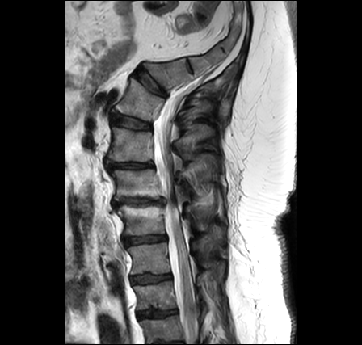</td>
<td></td>
<td></td>
</tr>

<tr>
<td>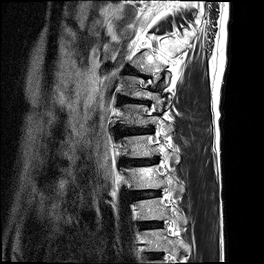</td>
<td>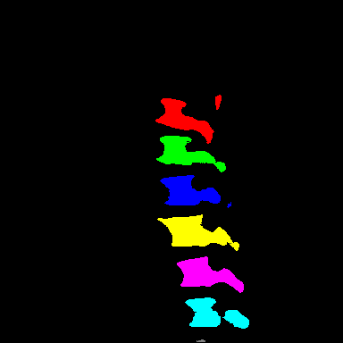</td>
<td></td>
</tr>

<tr>
<td>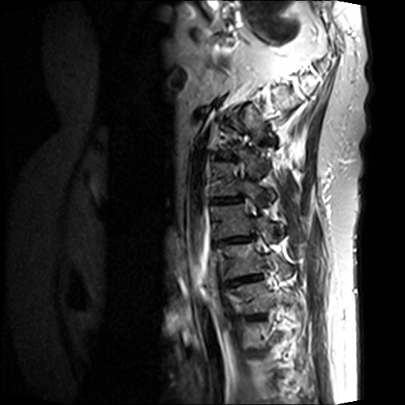</td>
<td>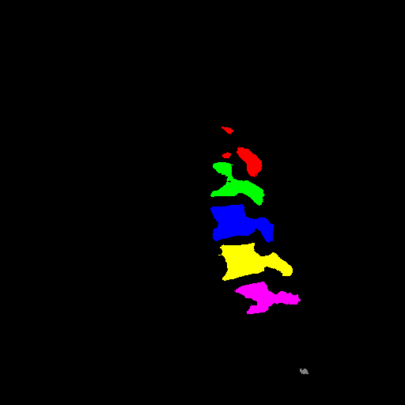</td>
<td>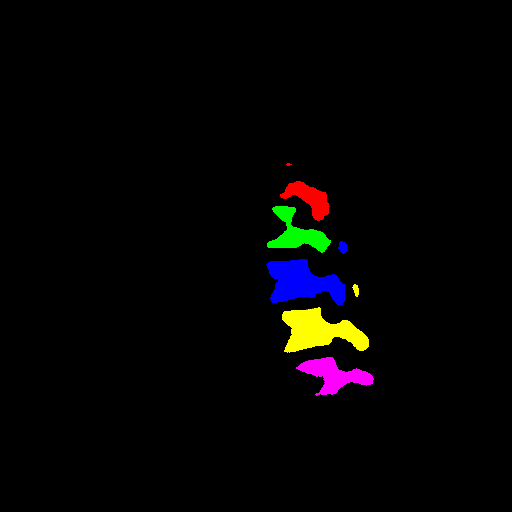</td>
</tr>
</table>

 
<h3>1  Dataset Citation</h3>
The dataset used here was derived from   
<a href="https://www.kaggle.com/datasets/dankok/spider-lumbar-spine-segmentation-in-mr-images">
<b>Lumbar Spine - [Segmentation]</b> </a>  
<b>SPIDER - Lumbar spine segmentation in MR images</b> 
on the kaggle.com.
  
The following explanation was taken from the kaggle web site.
  
<b>About Dataset</b> 
This is a large publicly available multi-center <b>lumbar spine magnetic resonance imaging (MRI)</b> dataset with reference segmentations 
of <b>vertebrae, intervertebral discs (IVDs), and the spinal canal.</b>
 
The dataset includes <b>447 sagittal T1 and T2 MRI series</b> from <b>218 studies of 218 patients</b> with a history of low back pain. 
The data was collected from <b>four different hospitals</b>. 
There is an additional hidden test set (not available here) used in the accompanying <b>SPIDER challenge</b> on spider.grand-challenge.org.
  
<b>Dataset Details</b> 
The assignment of MRI studies to training and validation sets can be found in the overview file. This file also provides: 
<ul>
<li>The biological sex of all patients</li>
<li>The age of patients (where available)</li>
<li>A number of scanner and acquisition parameters for each MRI study</li>
</ul>
 
The dataset also comes with radiological gradings (in a separate file) for the following degenerative changes:
 
1. Modic changes (type I, II, or III) 
2. Upper and lower endplate changes / Schmorl nodes (binary) 
3. Spondylolisthesis (binary) 
4. Disc herniation (binary) 
5. Disc narrowing (binary) 
6. Disc bulging (binary) 
7. Pfirrman grade (grade 1 to 5) 
All radiological gradings are provided per IVD level.
  
Dataset and public benchmark described in the paper:
<a href="https://www.nature.com/articles/s41597-024-03090-w">
<b>Lumbar spine segmentation in MR images: a dataset and a public benchmark</b></a>
 
Public segmentation challenge:<a href="https://spider.grand-challenge.org/"><b>SPIDER Challenge</b></a> 
 
<b>License</b> 
<a href="https://creativecommons.org/licenses/by/4.0/">Attribution 4.0 International (CC BY 4.0)</a>
 
 
<h3>
2 Lumbar-Spine ImageMask Dataset
</h3>
 If you would like to train this Lumbar-Spine Segmentation model by yourself,
please down load our dataset <a href="https://drive.google.com/file/d/10cmxgFT1Y8r7aYRt6WnaJbsWawr7OOmB/view?usp=sharing">
<b>Lumbar-Spine-ImageMask-Dataset.zip</b>
</a> on the google drive, expand the downloaded, and put it under <b>./dataset/</b> to be.
<pre>
./dataset
└─Lumbar-Spine
    ├─test
    │   ├─images
    │   └─masks
    ├─train
    │   ├─images
    │   └─masks
    └─valid
        ├─images
        └─masks
</pre>
We used the following 10 classes and colors mapping table to generate the <b>Lumbar-Spine-ImageMask-Dataset</b> with colorized masks from
the <b>SPIDER</b> MHA images and masks dataset.
  
<a id="color-class-mapping-table"><b>Lumbar-Spine color class mapping table</b></a>
 
<table border=1 style='border-collapse:collapse;' cellpadding='5'>
<tr><th>Indexed Color</th><th>Color</th><th>RGB</th><th>Class</th></tr>
<tr><td>0</td><td with='80' height='auto'></td><td>(0, 0, 0)</td><td>Class_0</td></tr>
<tr><td>1</td><td with='80' height='auto'></td><td>(255, 0, 0)</td><td>Class_1</td></tr>
<tr><td>2</td><td with='80' height='auto'></td><td>(0, 255, 0)</td><td>Class_2</td></tr>
<tr><td>3</td><td with='80' height='auto'></td><td>(0, 0, 255)</td><td>Class_3</td></tr>
<tr><td>4</td><td with='80' height='auto'></td><td>(255, 255, 0)</td><td>Class_4</td></tr>
<tr><td>5</td><td with='80' height='auto'></td><td>(255, 0, 255)</td><td>Class_5</td></tr>
<tr><td>6</td><td with='80' height='auto'></td><td>(0, 255, 255)</td><td>Class_6</td></tr>
<tr><td>7</td><td with='80' height='auto'></td><td>(128, 128, 128)</td><td>Class_7</td></tr>
<tr><td>8</td><td with='80' height='auto'></td><td>(255, 255, 255)</td><td>Class_8</td></tr>
<tr><td>9</td><td with='80' height='auto'></td><td>(128, 80, 0)</td><td>Class_9</td></tr>
</table>
  
<b>Lumbar-Spine Statistics</b> 
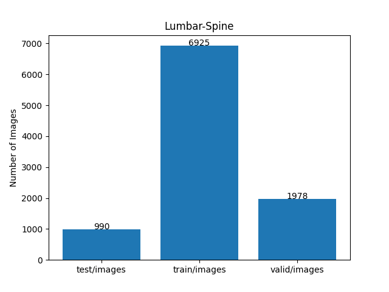 
 
As shown above, the number of images of train and valid datasets is large enough to use for a training set of our segmentation model.
  

<b>Train_images_sample</b> 
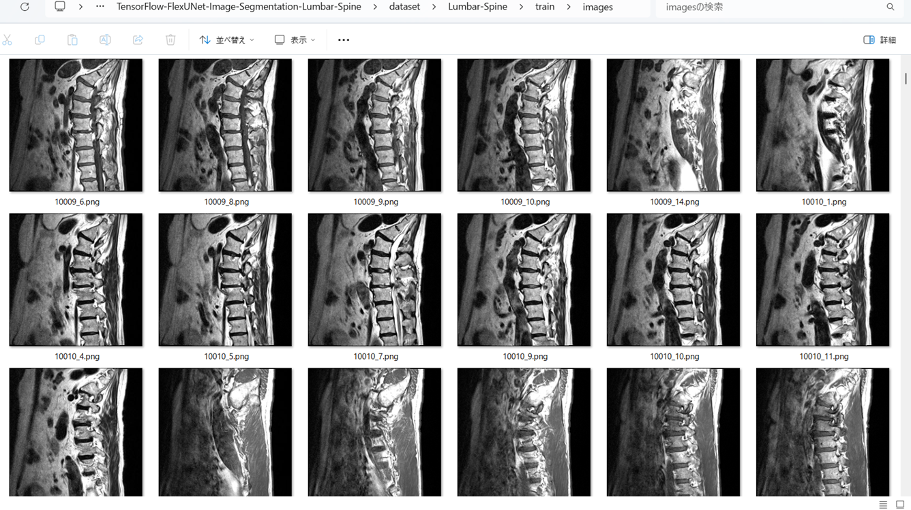
 
<b>Train_masks_sample</b> 
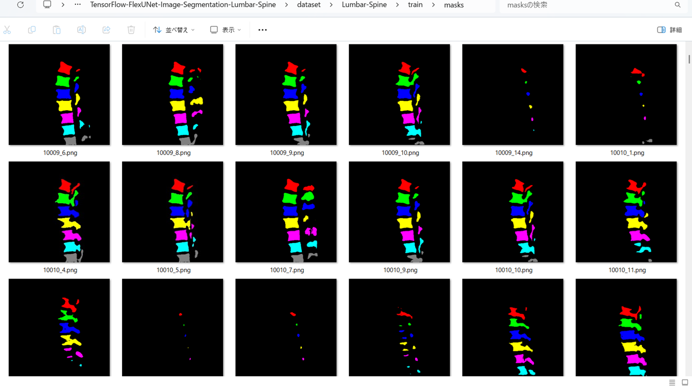
 
<h3>
3 Train TensorflowFlexUNet Model
</h3>
 We trained Lumbar-Spine TensorflowFlexUNet Model by using the following
<a href="./projects/TensorFlowFlexUNet/Lumbar-Spine/train_eval_infer.config"> <b>train_eval_infer.config</b></a> file.  
Please move to ./projects/TensorFlowFlexUNet/Lumbar-Spine, and run the following bat file. 
<pre>
>1.train.bat
</pre>
, which simply runs the following command. 
<pre>
>python ../../../src/TensorFlowFlexUNetTrainer.py ./train_eval_infer.config
</pre>

<b>Model parameters</b> 
Defined a small <b>base_filters=16</b> and a large <b>base_kernels=(11,11)</b> for the first Conv Layer of Encoder Block of 
<a href="./src/TensorFlowFlexUNet.py">TensorFlowFlexUNet.py</a> 
and a large num_layers (including a bridge between Encoder and Decoder Blocks).
<pre>
[model]
image_width    = 512
image_height   = 512
image_channels = 3
input_normalize = True
normalization  = False
num_classes    = 10
base_filters   = 16
base_kernels  = (11,11)
num_layers    = 8
dropout_rate   = 0.05
dilation       = (1,1)
</pre>
<b>Learning rate</b> 
Defined a small learning rate.  
<pre>
[model]
learning_rate  = 0.00007
</pre>
<b>Loss and metrics functions</b> 
Specified "categorical_crossentropy" and "dice_coef_multiclass". 
<pre>
[model]
loss           = "categorical_crossentropy"
metrics        = ["dice_coef_multiclass"]
</pre>
<b >Learning rate reducer callback</b> 
Enabled learing_rate_reducer callback, and a small reducer_patience.
<pre> 
[train]
learning_rate_reducer = True
reducer_factor     = 0.5
reducer_patience   = 4
</pre>
<b>Early stopping callback</b> 
Enabled early stopping callback with patience parameter.
<pre>
[train]
patience      = 10
</pre>
<b></b> 
<b>RGB color map</b> 
rgb color map dict for Lumbar-Spine 1+9 classes. 
<pre>
[mask]
mask_file_format = ".png"
;Lumbar-Spine 1+9
rgb_map = {(0,0,0):0, (255,0,0):1,(0,255,0):2,(0,0,255):3, (255,255,0):4,(255,0,255):5, (0,255,255):6,(128,128,128):7,(255,255,255):8, (128,80,0):9}
</pre>
<b>Epoch change inference callbacks</b> 
Enabled epoch_change_infer callback. 
<pre>
[train]
epoch_change_infer       = True
epoch_change_infer_dir   =  "./epoch_change_infer"
epoch_changeinfer        = False
epoch_changeinfer_dir    = "./epoch_changeinfer"
num_infer_images         = 6
</pre>
By using this epoch_change_infer callback, on every epoch_change, the inference procedure can be called
 for 6 images in <b>mini_test</b> folder. This will help you confirm how the predicted mask changes 
 at each epoch during your training process.    
<b>Epoch_change_inference output at starting (1,2,3)</b> 
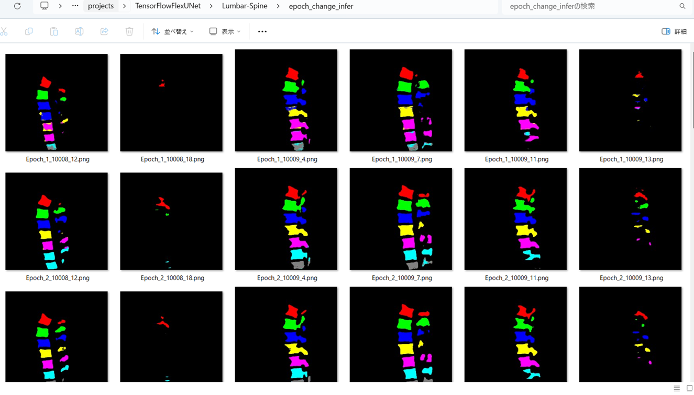 
 
<b>Epoch_change_inference output at middle-point (8,9,10)</b> 
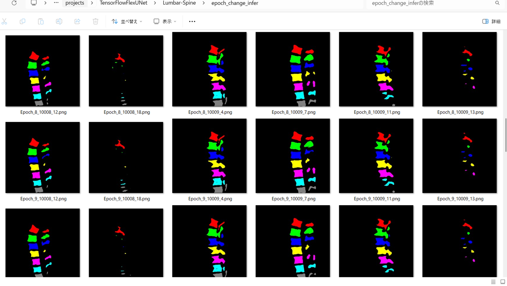 
 
<b>Epoch_change_inference output at ending (18,19,20)</b> 
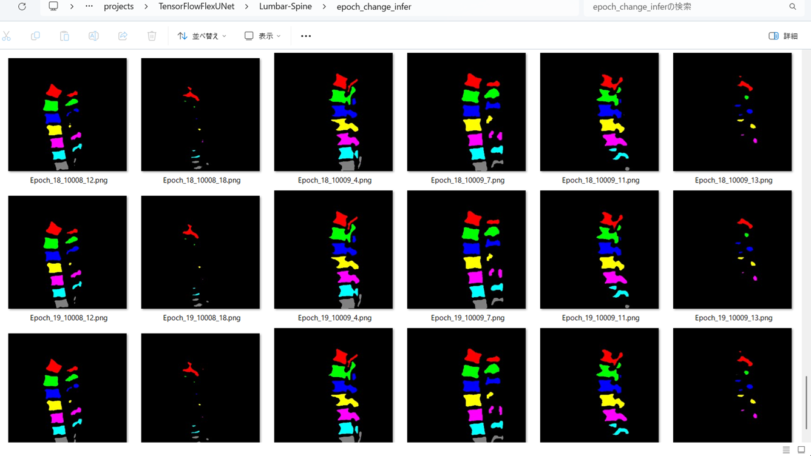 

 
In this experiment, the training process was terminated at epoch 20.  
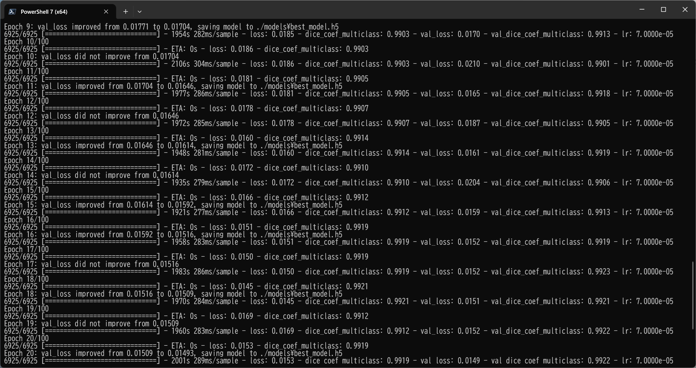 
 
<a href="./projects/TensorFlowFlexUNet/Lumbar-Spine/eval/train_metrics.csv">train_metrics.csv</a> 
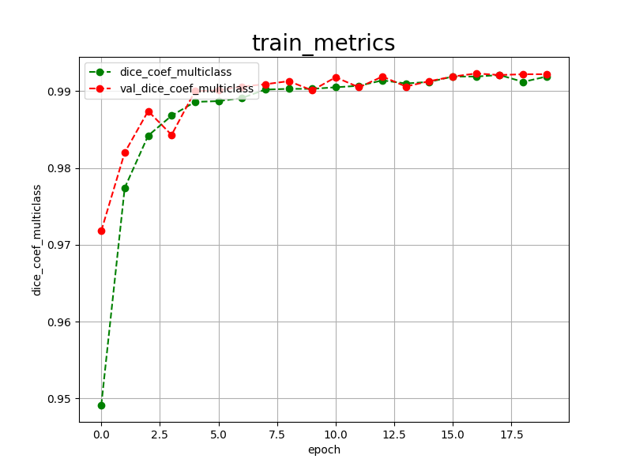 

 
<a href="./projects/TensorFlowFlexUNet/Lumbar-Spine/eval/train_losses.csv">train_losses.csv</a> 
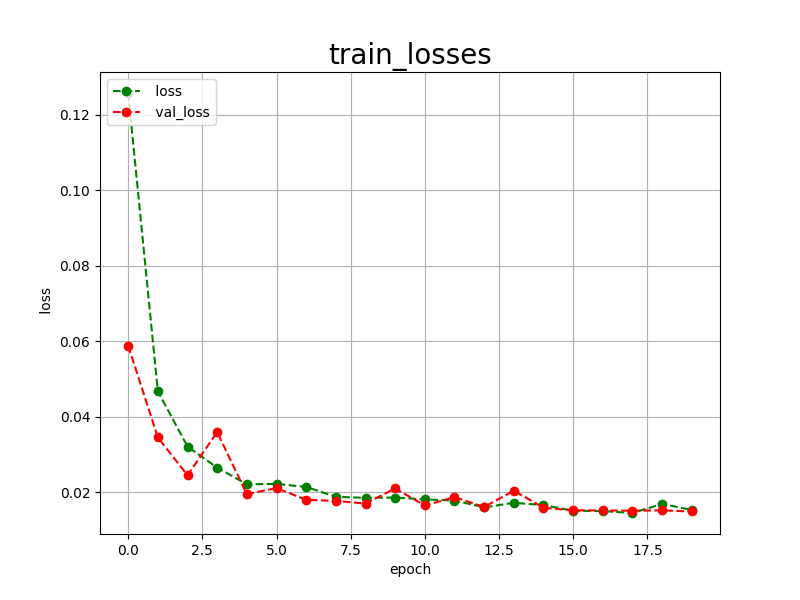 
 
<h3>
4 Evaluation
</h3>
Please move to a <b>./projects/TensorFlowFlexUNet/Lumbar-Spine</b> folder, and run the following bat file to evaluate TensorflowFlexUNet model for Lumbar-Spine. 
<pre>
>./2.evaluate.bat
</pre>
This bat file simply runs the following command.
<pre>
>python ../../../src/TensorFlowFlexUNetEvaluator.py  ./train_eval_infer.config
</pre>
Evaluation console output: 
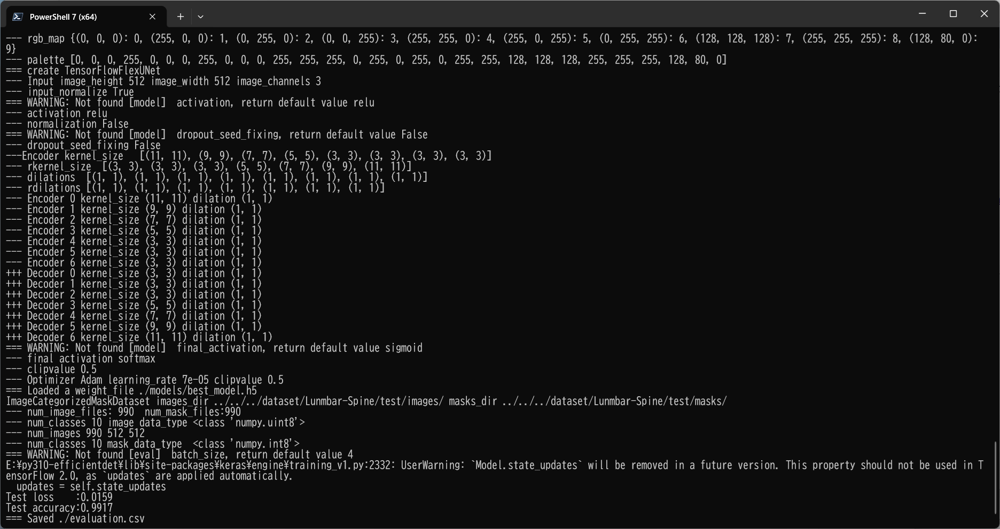
  Image-Segmentation-Lumbar-Spine

<a href="./projects/TensorFlowFlexUNet/Lumbar-Spine/evaluation.csv">evaluation.csv</a> 
The loss (categorical_crossentropy) to this Lumbar-Spine/test was low, and dice_coef_multiclass high as shown below.
 
<pre>
categorical_crossentropy,0.0159
dice_coef_multiclass,0.9917
</pre>
 
<h3>5 Inference</h3>
Please move to a <b>./projects/TensorFlowFlexUNet/Lumbar-Spine</b> folder, and run the following bat file to infer segmentation regions for images by the Trained-TensorflowFlexUNet model for Lumbar-Spine. 
<pre>
>./3.infer.bat
</pre>
This simply runs the following command.
<pre>
>python ../../../src/TensorFlowFlexUNetInferencer.py ./train_eval_infer.config
</pre>

<b>mini_test_images</b> 
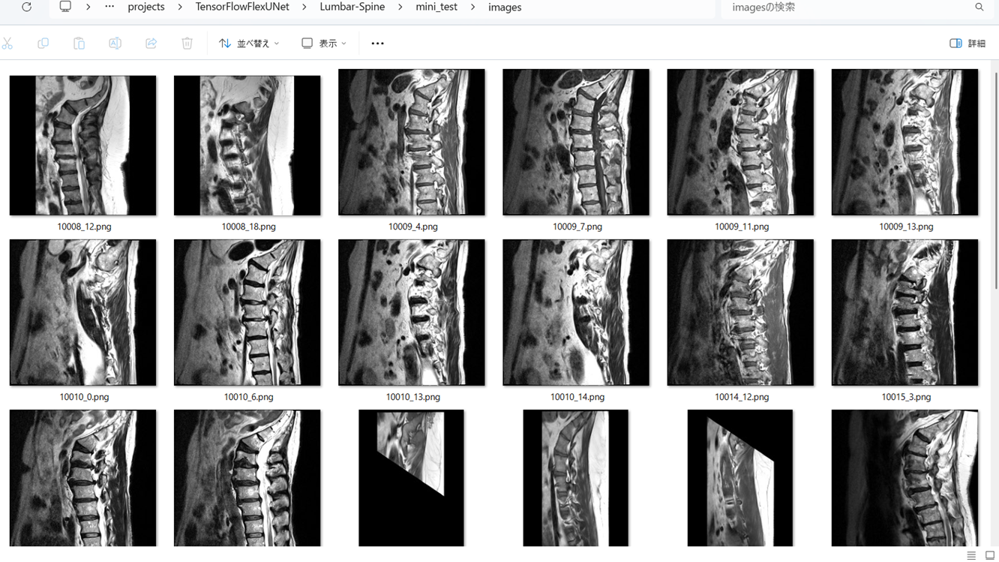 
<b>mini_test_mask(ground_truth)</b> 
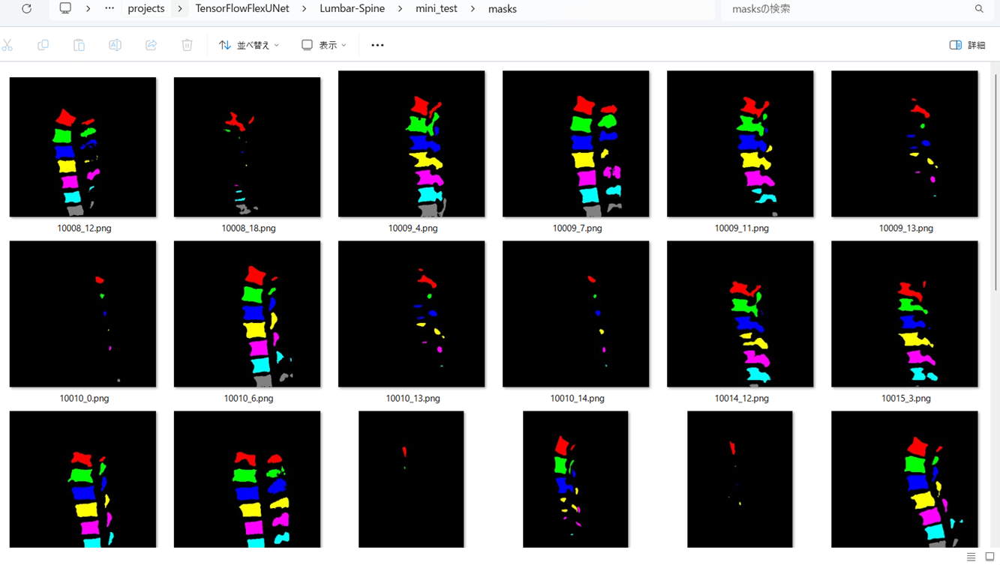 

<b>Inferred test masks</b> 
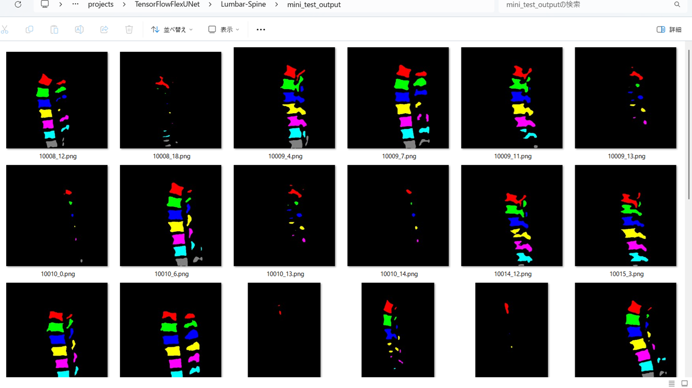 
 

<b>Enlarged images and masks for  Lumbar-Spine  Images</b> 
As shown below, the inferred masks predicted by our segmentation model trained by the dataset appear similar to the ground truth masks.
 
<a href="#color-class-mapping-table">Color class mapping table</a>
 
 
<table>
<tr>
<th>Input: image</th>
<th>Mask (ground_truth)</th>
<th>Prediction: inferred_mask</th>
</tr>
<tr>
<td>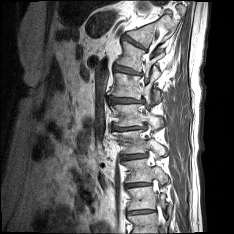</td>
<td></td>
<td></td>
</tr>

<tr>
<td>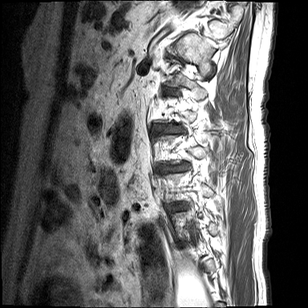</td>
<td></td>
<td>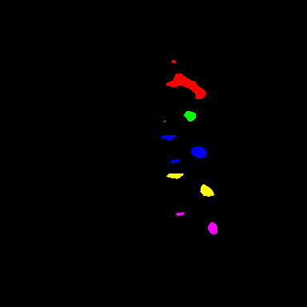</td>
</tr>

<tr>
<td>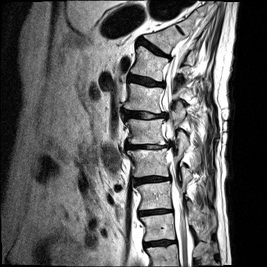</td>
<td>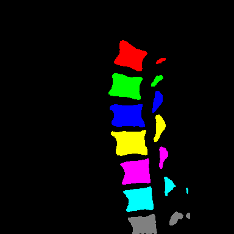</td>
<td>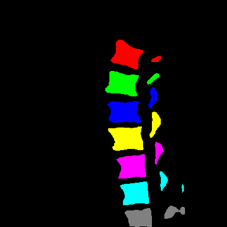</td>
</tr>
<tr>
<td>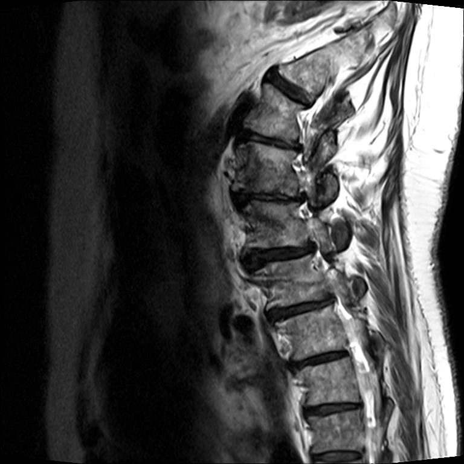</td>
<td>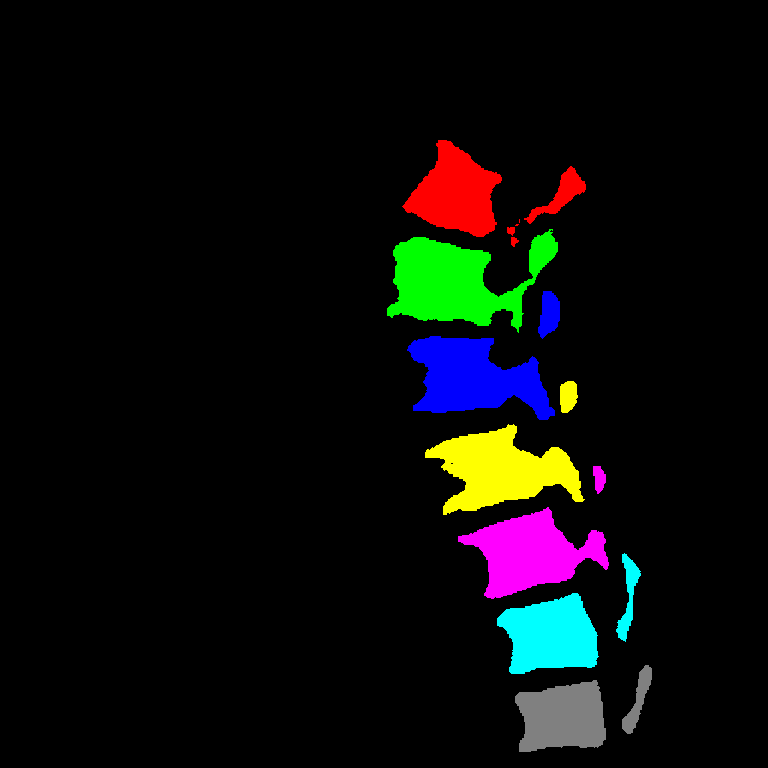</td>
<td>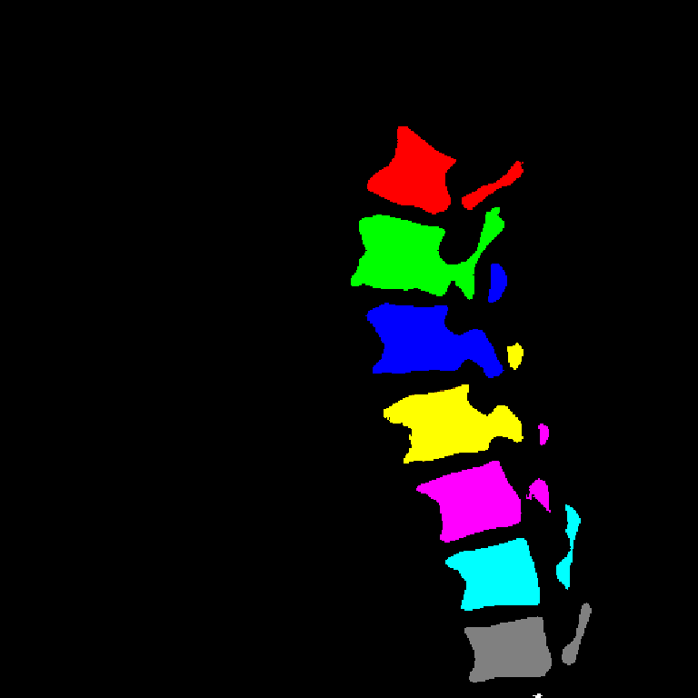</td>
</tr>
<tr>
<td>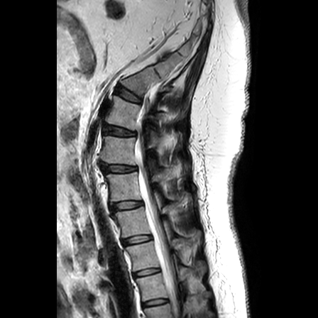</td>
<td>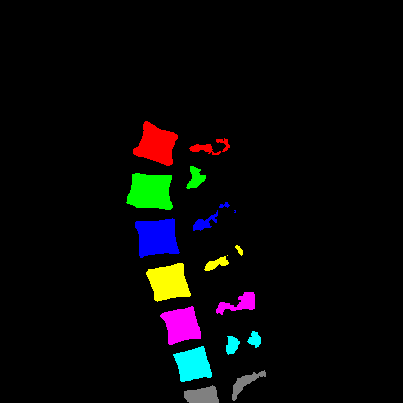</td>
<td></td>
</tr>
<tr>
<td>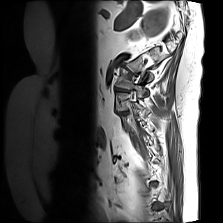</td>
<td>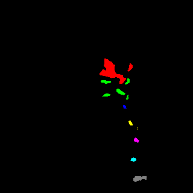</td>
<td>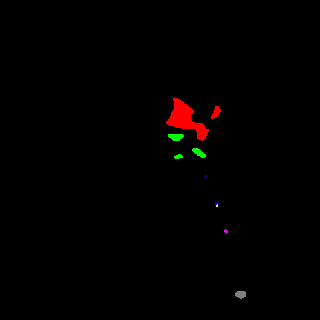</td>
</tr>
</table>

 
<h3>
References
</h3>

<b>1. Lumbar spine segmentation in MR images: a dataset and a public benchmark</b> 
Jasper W. van der Graaf, Miranda L. van Hooff, Constantinus F. M. Buckens, Matthieu Rutten, Job L. C. van Susante,  
Robert Jan Kroeze, Marinus de Kleuver, Bram van Ginneken & Nikolas Lessmann 
<a href="https://www.nature.com/articles/s41597-024-03090-w">
https://www.nature.com/articles/s41597-024-03090-w</a>
 
 
<b>2. Lumbar spine segmentation method based on deep learning</b> 
Hongjiang Lu, Mingying Li, Kun Yu, Yingjiao Zhang, Liang Yu 
<a href="https://aapm.onlinelibrary.wiley.com/doi/10.1002/acm2.13996">
https://aapm.onlinelibrary.wiley.com/doi/10.1002/acm2.13996</a>
  
<b>3. Automatic semantic segmentation of the lumbar spine: Clinical applicability in a multi-parametric and multi-center study on magnetic resonance images</b> 
Jhon Jairo Sáenz-Gamboa, Julio Domenech, Antonio Alonso-Manjarrés, Jon A. Gómez, Maria de la Iglesia-Vayá  
<a href="https://www.sciencedirect.com/science/article/pii/S0933365723000738">
https://www.sciencedirect.com/science/article/pii/S0933365723000738</a>
  
<b>4. TensorFlow-FlexUNet-Image-Segmentation-Model</b> 
Toshiyuki Arai  
<a href="https://github.com/sarah-antillia/TensorFlow-FlexUNet-Image-Segmentation-Model">
https://github.com/sarah-antillia/TensorFlow-FlexUNet-Image-Segmentation-Model
</a>
 
 
